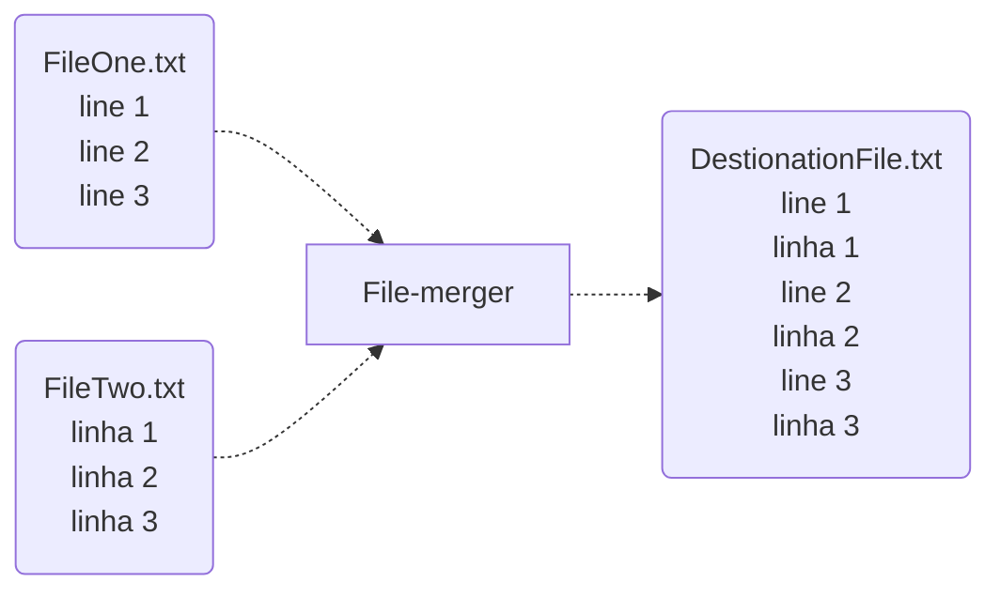

# File Merger
This project does take two files that you pass and merge then into one destination file, copying line by line from the two sources, alternatively.

### What it does


### Purpose

The initial purpose was my learning of Latin. So I wanted to take two .tsv files of the Bible, one in English and one in Latin and merge them line by line.

Then I used [this repo](https://github.com/LukeSmithxyz/kjv/tree/master) that reads tsv files, and used it for my Latin/kjv one.

## Usage (Linux)
It compiles in Go, so if you don't have it:
```
rm -rf /usr/local/go && tar -C /usr/local -xzf go1.22.4.linux-amd64.tar.gz
```
Build and run:
```sh
# Build
make 

# Run
./file-merger \
  -source1=yourFileOne.txt \
  -source2=yourFileTwo.txt \
  -destination=yourDestinationFile.txt
```

